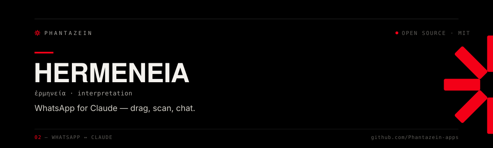

<div align="center">



<p>
  <a href="https://github.com/Phantazein-apps/hermeneia/releases/latest"></a>
  
  
  
  
</p>

**Let your AI read and send your WhatsApp messages — running entirely on your own machine.**

Hermeneia is built for **local, self-hosted AI**. The primary way to use it is [**Refugio**](https://github.com/Phantazein-apps/refugio) — a private AI that runs on your own computer (macOS, Linux, or Windows), no cloud and no API keys. It also works with **Claude Desktop**, **OpenAI Codex**, and any other MCP client.

<sub>**ἑρμηνεία** — *interpretation, translation between worlds* · from Hermes, messenger of the gods<br>Part of the <a href="https://phantazein.com">Phantazein</a> toolkit</sub>

</div>

---

> 🚧 **Work in progress.** Hermeneia is under active development — thousands of messages flow through it daily, but expect the occasional rough edge.

## Get started

The intended home for Hermeneia is **[Refugio](https://github.com/Phantazein-apps/refugio)** — a fully self-hosted AI that owns your WhatsApp end to end, so nothing leaves your computer and no third party (not even Anthropic) is in the loop. If you'd rather use Claude, there's a quick drag-install path too.

### Recommended — Refugio (a private AI on your own machine)

[Refugio](https://github.com/Phantazein-apps/refugio) is a one-command install of a local LLM + [Open WebUI](https://github.com/open-webui/open-webui) that runs on **macOS, Linux, or Windows**. Its setup wizard installs Hermeneia and links your WhatsApp for you — no separate download, no build step:

```bash
# macOS / Linux (Windows: see the Refugio README)
curl -fsSL https://raw.githubusercontent.com/Phantazein-apps/refugio/main/install-refugio | bash
```

When the wizard reaches the **WhatsApp** step it opens a QR page (and prints the URL, so it works on a headless or remote host over an SSH tunnel too). On your phone: **WhatsApp → Settings → Linked Devices → Link a Device**, then scan. That's it — your WhatsApp now lives inside your own local AI. Ask it *"summarize my unread WhatsApp"* or *"what did Mom send me this week?"* right in Open WebUI. Already running Refugio? Re-run the installer and it'll offer to add or re-link WhatsApp.

### Alternative — Claude Desktop (macOS, 2-minute drag-install)

Prefer Claude Desktop? On a **Mac with an Apple chip** you can install Hermeneia as an extension instead:

1. **Download** the latest `hermeneia-x.x.x.mcpb` from the [Releases page](https://github.com/Phantazein-apps/hermeneia/releases/latest) (under "Assets"), using the free [Claude app for Mac](https://claude.ai/download).
2. **Drag it onto the Claude window.** Claude asks to install it — you'll see the standard *"access to everything… not verified by Anthropic"* notice that appears for **every** third-party extension (everything stays on your Mac; see [Is this safe?](#is-this-safe)). Click **Install**.
3. **Connect WhatsApp:** type *"check my WhatsApp status"*, a QR page opens in your browser, and on your phone go to **WhatsApp → Settings → Linked Devices → Link a Device** and scan it.
4. **Try it:** give it a few minutes to sync (up to 3 years of history), then ask *"summarize my unread WhatsApp messages"*, *"find the message with the Airbnb link"*, or *"show me the photo Tyler sent yesterday."*

You only scan once — the link survives restarts. Claude always shows you a message before sending, and asks which account to use if you've connected more than one.

### Try it without connecting WhatsApp

Want to see what Hermeneia can do before scanning a QR code? Set `HERMENEIA_DEMO=1` (or flip **Demo mode** in the Claude extension's settings) and your assistant gets a full set of realistic sample contacts, chats, and messages — no WhatsApp account, no real data, nothing sent anywhere.

## Is this safe?

**Your messages never leave your computer.** Everything is stored in a local database on the machine running Hermeneia — your Refugio host or your Mac. Hermeneia only talks to WhatsApp's own servers — the exact same ones the WhatsApp app on your phone talks to. No cloud service, no telemetry, no account to create, and the entire source code is public in this repository.

On your phone, Hermeneia shows up as a linked device (WhatsApp → Settings → Linked Devices) — the same mechanism as WhatsApp Web or WhatsApp on a second computer. By default it's named **"Claude"**; a host can rename it (Refugio brands it, and you can set `HERMENEIA_DEVICE_NAME` yourself).

**To disconnect at any time:** on your phone, WhatsApp → Settings → Linked Devices → tap the Hermeneia device → **Log Out**. To remove Hermeneia completely, delete the Refugio connector (or the Claude extension, if that's how you installed it).

A note on how it works: WhatsApp doesn't offer an official way for personal accounts to connect outside apps, so Hermeneia — like every WhatsApp tool of this kind — uses the same protocol WhatsApp Web uses. That's also why it can't appear in Anthropic's "verified" directory, which requires an official login flow that WhatsApp doesn't provide.

## Common questions

**"It can't find an old message I know exists."** WhatsApp only hands linked devices part of your history — active chats get years of messages, quiet ones sometimes get none. Fix: open that chat in WhatsApp *on your phone* and leave it on screen for a minute or two; WhatsApp will usually push its history over. New messages always come through reliably.

**"The QR page didn't open."** Ask your assistant to *"check my WhatsApp status"* again (or, under Refugio, re-run the installer's WhatsApp step) for a fresh QR. On a headless host, open the setup URL it prints (`http://127.0.0.1:3456/setup`).

**"It says linked but WhatsApp isn't connected."** WhatsApp can revoke a linked device on its own, or you may have removed the Hermeneia device from your phone — nothing on the host changes, so it can look linked when it isn't. Just re-link: get a fresh QR (above) and scan again. If your phone refuses to link, you may have hit WhatsApp's 4-device limit — remove old linked devices first.

**"It stopped seeing new messages."** Restart Hermeneia (restart Refugio, or quit and reopen the Claude app). It also watches its own connection and restarts the bridge automatically if WhatsApp goes quiet.

**"Which platforms does it run on?"** The bridge is pure Go and runs on **macOS (Apple Silicon + Intel), Linux (x64 + arm64), and Windows** — which is why Refugio can host it on a headless Linux box. The one-click Claude Desktop drag-install is macOS Apple Silicon for now; every other combination runs via Refugio, from source, or a prebuilt bridge binary. See [Works with](#works-with). (Just your phone alone, no — Hermeneia needs a computer to run on.)

**"Does this work with more than one WhatsApp number?"** Yes — see below.

## Multiple WhatsApp accounts

Connect as many WhatsApp numbers as you want (personal, work, family…):

1. Ask your assistant: **"add another WhatsApp account called work"**
2. A new QR page opens — scan it with the other phone
3. Done — searches now cover all your accounts, and your assistant asks which one to send from

All accounts reconnect automatically on restart.

---

<div align="center">

**Everything below this line is for technical users** — using Hermeneia with other AI apps, how it works inside, and how to build it from source. If you just wanted WhatsApp in your AI, you're done. 🎉

</div>

---

## Works with

Hermeneia is a standard stdio MCP server, so it plugs into anything that can spawn one. **Refugio** (see [Get started](#get-started)) is the recommended host and sets all of this up for you. The sections below cover pointing Refugio at your own checkout, plus Codex, Claude Code, Cursor, and other clients. For those, build once and point the client at `dist/index.js`:

```bash
git clone https://github.com/Phantazein-apps/hermeneia.git
cd hermeneia
npm install
npm run build   # bundles dist/index.js + the Go bridge for your platform
```

The Go bridge is pure Go (no CGO), so `npm run build` cross-compiles cleanly on macOS (Apple Silicon + Intel), Linux (x64 + arm64), and Windows. Don't want a Go toolchain? Every [release](https://github.com/Phantazein-apps/hermeneia/releases/latest) also ships standalone `hermeneia-bridge-<os>-<arch>` binaries as `.tar.gz` assets — download the one for your platform and drop it next to `dist/index.js`.

### Refugio (recommended host)

The [Refugio](https://github.com/Phantazein-apps/refugio) installer already clones Hermeneia, fetches the bridge binary for your platform, links your WhatsApp via QR, and wires it into Open WebUI through MCPO — nothing to configure by hand. To point Refugio at your **own** Hermeneia checkout instead, set `HERMENEIA_DIR` in `~/.refugio.env`:

```bash
# ~/.refugio.env
HERMENEIA_DIR=/path/to/hermeneia
```

Refugio's supervisor picks it up and your WhatsApp tools appear in Open WebUI alongside the other connectors.

> **Tip for local models:** Hermeneia exposes 18 tools. Larger tool-calling-capable models handle this well; small models may struggle with tool selection.

### OpenAI Codex

```toml
# ~/.codex/config.toml
[mcp_servers.whatsapp]
command = "node"
args = ["/path/to/hermeneia/dist/index.js"]
```

### Any other MCP client

Generic MCP server config (Claude Code, Cursor, Windsurf, etc.):

```json
{
  "mcpServers": {
    "whatsapp": {
      "command": "node",
      "args": ["/path/to/hermeneia/dist/index.js"]
    }
  }
}
```

## Full capability list

- **Read messages** — search, filter by date/contact/chat, get context around any message
- **Unread summary** — using native WhatsApp unread counts; archived chats excluded by default
- **Send messages** — text, images, videos, documents, voice notes
- **Download and view images** — inline, not just file paths
- **Browse contacts** — search by name or phone number; full contact resolution (phone numbers, LIDs, push names, verified names)
- **Browse chats** — all conversations with unread counts; community/parent-group awareness
- **Deep history** — syncs up to 3 years of message history (1,000 messages per chat) on first connect
- **Multi-account** — `list_accounts`, `add_account`, `remove_account`

18 MCP tools in total.

## Architecture

A Go subprocess handles the WhatsApp connection; a Node.js process runs the MCP server and SQLite store.

1. **Go bridge** — [whatsmeow](https://github.com/tulir/whatsmeow) handles the WhatsApp Web protocol, QR auth, history sync, and message sending
2. **MCP server** — [@modelcontextprotocol/sdk](https://github.com/modelcontextprotocol/typescript-sdk) exposes 18 tools via stdio
3. **SQLite** — [sql.js](https://github.com/sql-js/sql.js) stores messages, chats, and contacts locally
4. **Setup page** — local HTTP server for QR code display (only during auth)

```
MCP client (Claude / Refugio / Codex / …) ←→ MCP (stdio) ←→ Node.js ←→ Go bridge ←→ WhatsApp
                                                              ↕
                                                           SQLite
                                                        (local data)
```

## How Hermeneia compares

*Last updated: April 21, 2026*

Origin chain: [`lharries/whatsapp-mcp`](https://github.com/lharries/whatsapp-mcp) (original, abandoned April 2025) → [`verygoodplugins/whatsapp-mcp`](https://github.com/verygoodplugins/whatsapp-mcp) (active fork, Python + Go) → Hermeneia (TypeScript + Go rewrite).

### What Hermeneia adds vs the upstream fork

- **TypeScript MCP layer** (vs Python upstream). Same Go/whatsmeow bridge, but ships as a single Node bundle with no Python toolchain.
- **`.mcpb` drag-and-drop install** vs `git clone` + `uv` setup. Drag onto Claude Desktop, scan QR, done.
- **Multi-account** - connect personal, work, family, business numbers in parallel; searches span all accounts by default. Upstream is single-account.
- **Deep history sync on first connect** (3 years / 1,000 msgs per chat). Upstream syncs forward from connection time only.
- **Inline image display** - `download_media` returns the image so your assistant sees photos. Upstream returns file paths.
- **Unread tracking + filtering** using native WhatsApp counts. Upstream has no unread state.
- **Archived chat detection** (excluded by default).
- **Community / parent-group awareness** - chats know which Community they belong to.
- **Full contact resolution** - phone numbers, LIDs, push names, verified names. Upstream stops at JIDs.
- **Named linked device** in WhatsApp Linked Devices instead of a generic browser string — defaults to "Claude", set your own with `HERMENEIA_DEVICE_NAME` (Refugio brands it).
- **18 tools** vs upstream's ~10 — or 5, with `HERMENEIA_TOOL_PROFILE=minimal`. Finer tools mean more precise calls from a large model, but a small local model loses accuracy as the list grows, and account management and internal backfill aren't what anyone asks a chat window for. The minimal profile keeps `search_contacts`, `list_chats`, `list_messages`, `send_message`, `download_media`. Refugio sets it automatically; the default is unchanged.

### Vs other WhatsApp MCPs

- **`jlucaso1` (Baileys TS)** - different protocol library; missing whatsmeow's media fidelity. No `.mcpb`, no multi-account.
- **`wweb-mcp` / `fyimail/whatsapp-mcp2`** - Puppeteer + `whatsapp-web.js`. Brittle, breaks on WhatsApp updates. Author flags it as "testing only."
- **41-tool extended fork** - broader tool surface (group admin, presence, webhooks) but less polish (no `.mcpb`, no inline images).
- **WhatsApp Cloud API MCPs** (`wania-kazmi` etc.) - Business API only, can't touch personal accounts. Different product.
- **Commercial bridges** (Composio, Whapi.Cloud, Maytapi, Telinfy) - paid SaaS routing your messages through their cloud. Hermeneia stays local.

### Trade-offs

- The one-click `.mcpb` install targets macOS Apple Silicon. The bridge itself is cross-platform (pure Go, no CGO — macOS arm64/amd64, Linux amd64/arm64, Windows amd64), so other platforms run from source or a prebuilt bridge binary. Windows binaries are built and CI-tested at the TS layer, but the one-click Windows install stays gated until a full manual QR smoke test lands.
- No webhook forwarding for incoming messages (upstream `verygoodplugins` has this).
- No semantic search over message history (IMAP-search-equivalent only).

## Beta: Epistole mirror

> **Not for everyone.** This section only applies if you run (or plan to run) your own [Epistole](https://github.com/Phantazein-apps/epistole) server — a Cloudflare Worker you deploy to your own Cloudflare account. If you don't have one, none of this applies; skip the section and use Hermeneia as-is from your Mac. Setting up Epistole is a separate ~30-minute project; see Epistole's README.

Hermeneia can optionally push a copy of incoming WhatsApp events to a remote Epistole instance so that Epistole's `semantic_search` indexes WhatsApp history alongside email. **Off by default.** Enabling the mirror does not change any existing behavior — sends, media, and the local `messages.db` all still live on the host running Hermeneia.

### Why would you want this?

The main reason: **remote access**. Hermeneia runs on one machine — your WhatsApp history is only searchable from that host (your Refugio box or the Mac running Claude Desktop). Epistole is a Cloudflare Worker you control, reachable from anywhere via the remote MCP protocol — including the Claude mobile apps (iOS, Android, web). Turning on the mirror means:

- Ask from your phone *"what did Tyler say about Thursday?"* and get hits from WhatsApp + email in the same answer
- Semantic search (not just substring) across your WhatsApp messages — *"the message where my mom sent the Airbnb link"*
- Unified ranking across channels — one query, results from email and WhatsApp interleaved by relevance

It's strictly additive. Your desktop Hermeneia keeps doing everything it did before (sending, media, local search via `list_messages`). The mirror is just a fan-out write pipe for the subset of use cases that benefit from being remote.

### What it mirrors

- After each durable local write (message, chat, contact), best-effort POSTs a copy to `POST /api/wa/push` on your Epistole instance.
- Batches events (1.5s debounce, 50-event flush) and sends one-way over HTTPS with a Bearer token.
- Sends a heartbeat every ~60s per connected account so Epistole knows the bridge is alive.
- One-shot historical backfill via the `epistole_backfill` MCP tool — walks existing `messages.db` for an account and ships it in batches of 100.

### What it does NOT do

- **No media bytes are uploaded.** Only metadata (media type, filename, caption text). Voice notes, photos, docs stay on your host.
- **No remote sends.** Epistole cannot send WhatsApp messages through Hermeneia — the channel is push-only, Hermeneia → Epistole. If you ask from your phone "send Tyler a message", that tool isn't exposed. You'd need to be on the host running Hermeneia.
- **No state dependency.** If Epistole is unreachable, the call is dropped after short exponential backoff; Hermeneia keeps running normally. Lossy by design — the local `messages.db` remains the source of truth.
- **No cloud-locked contacts.** `chat_name` is passed at embedding time only (improves retrieval quality for group-scoped queries); Epistole doesn't store a copy of your contact list beyond what it needs for search.

### Configuration — the usual way (recommended)

After installing v0.4.8+ from [Releases](https://github.com/Phantazein-apps/hermeneia/releases/latest):

1. Claude Desktop → **Settings** → **Extensions** → **WhatsApp (Hermeneia)**
2. Fill in:
   - **Epistole mirror URL** — the base URL of your Epistole server (e.g. `https://mailstore.example.com`). Leave empty to keep the mirror disabled.
   - **Epistole mirror token** — the `WA_BRIDGE_TOKEN` secret, same value as on the Epistole side. Stored locally by Claude Desktop.
   - **Epistole account allowlist** *(optional)* — comma-separated account IDs to mirror, e.g. `personal,work`. Leave empty to mirror **all** connected accounts.
3. Restart the extension (toggle off then on, or fully quit Claude Desktop and relaunch).

On next start, you should see `[hermeneia] Epistole mirror: https://... (all accounts)` in the MCP server log (`~/Library/Logs/Claude/mcp-server-WhatsApp (Hermeneia).log`).

### Configuration — via environment variables

If you run Hermeneia outside Claude Desktop (e.g. `npm run dev` during development, or under Refugio/Codex), the same env vars apply directly:

```bash
EPISTOLE_MIRROR_URL=https://your-epistole-host
EPISTOLE_MIRROR_TOKEN=<WA_BRIDGE_TOKEN>
EPISTOLE_MIRROR_ACCOUNTS=personal,work   # optional allowlist
```

Either `URL` or `TOKEN` unset → mirror is a complete no-op.

### Where to find your token

The token is a shared password between Epistole (the server) and Hermeneia (this client) — the `WA_BRIDGE_TOKEN` Cloudflare Worker secret on the Epistole side. How you got it depends on when and how you deployed Epistole:

**If you installed Epistole with the WhatsApp bridge enabled** — the installer asked *"Enable WhatsApp bridge endpoint? [y/N]"* and you answered **y**. It generated a random 64-character token, stored it as the Worker secret, and printed the token twice during install with a *"save this now"* callout. That's the token. Paste it into the Hermeneia field. If you didn't save it, jump to *Rotating* below.

**If you deployed Epistole before the WhatsApp bridge shipped, or said "n" at the prompt** — the secret doesn't exist yet. Create it now from inside the Epistole repo:

```bash
# Generate a random value you can paste into both sides
openssl rand -hex 32
# Then set it as the Cloudflare secret (you'll be prompted for the value)
wrangler secret put WA_BRIDGE_TOKEN
wrangler deploy
```

Paste the same value into Hermeneia's **Epistole mirror token** field.

**Rotating (you lost the value or want to refresh it)** — re-run the same two commands with a fresh value, then update Hermeneia's field to match. Nothing breaks; the old token is simply invalidated.

**Cloudflare never shows existing secret values.** That's by design. If the value isn't in your password manager / shell history / `.dev.vars`, rotation is the right answer — it's 30 seconds of work.

Keep the token private. Anyone with it can write mirror data to your Epistole instance (they can't read data back — the push endpoint is one-way — but they could pollute your search index).

### Initial backfill

New messages arriving after you enable the mirror ship automatically. To backfill history that was already in `messages.db` when you enabled it, ask Claude:

> *"Run `epistole_backfill` on account `default`."*

You can cap the run with `max_batches: N` (each batch is 100 messages, newest-first) if you want to trickle a large history over multiple sessions. For a large `personal` account that's tens of thousands of messages, start with `max_batches: 5` to confirm Epistole's ingestion before committing to the whole history.

### Where to run `epistole_backfill`

**From a surface where Hermeneia's own tools are live** — that means Open WebUI when you run Hermeneia under Refugio, or a regular Claude Desktop chat. Those are the surfaces that can actually reach the local bridge.

Places the tool *won't* be available:

- **Cowork** — runs your task in the cloud, can only reach remote/cloud MCPs, not the local Hermeneia process.
- **Claude mobile / Claude.ai web** — same reason. They can't reach the Node process sitting on your host.
- **Claude Code** (CLI) — uses its own MCP config, doesn't automatically include Claude Desktop's extensions.

If you try to run `epistole_backfill` from any of those and see *"no tool called epistole_backfill available"*, it's not broken — you're on the wrong surface. Switch to Open WebUI (Refugio) or a Claude Desktop chat.

This split is intentional and is actually the point of the mirror: you **backfill and live-mirror from the host** (writer side), then **search the mirrored data from anywhere via Epistole's `semantic_search`** (reader side — works from mobile, web, Cowork, Code, everywhere).

### WhatsApp sync is not exhaustive — and never will be

If a search doesn't find a message you *know* exists in a WhatsApp chat on your phone, check `messages.db` first — odds are the message isn't in Hermeneia either, which means the mirror never had a chance to push it.

WhatsApp's multi-device protocol deliberately delivers only a subset of history to linked devices. In practice:

- Chats with recent two-way activity get deep history sync (often years' worth)
- Chats that have been quiet for several months may get **zero messages** delivered — the server decides they aren't worth the bandwidth
- There is no public or reverse-engineered API to request a specific chat's full history on demand. Every whatsmeow-based client has this limit.

**To nudge specific chat history into Hermeneia**: open that chat in WhatsApp **on your phone** and leave it foregrounded for a minute or two. WhatsApp often pushes `HistorySyncNotification` for the "currently viewed" chat. Sending a message in the chat (then deleting it) is an even stronger signal. Failing that, scrolling back through the chat on the phone can trigger context delivery to linked devices.

New messages arriving going forward are not affected — the live mirror catches them reliably. This limit only affects old history that WhatsApp never handed off.

### Watchdog (independent of the mirror)

Hermeneia monitors each connected bridge for event activity. If no events arrive from a connected account for `HERMENEIA_WATCHDOG_TIMEOUT_MS` (default 5 min), the Go subprocess is SIGKILLed and respawned with exponential backoff (5s → 30s cap). This is always on; the mirror has nothing to do with it.

```bash
HERMENEIA_WATCHDOG_TIMEOUT_MS=300000  # 5 min
HERMENEIA_WATCHDOG_CHECK_MS=60000     # 1 min poll
HERMENEIA_RESPAWN_CAP=5               # give up after N consecutive failed respawns
```

### Session reliability

- **Per-account bridge logs** are written to `<dataDir>/logs/bridge-<accountId>.log` (captures the Go/whatsmeow stderr, invaluable for diagnosing silent session drops).
- When WhatsApp revokes a linked device, Hermeneia catches the `logged_out` event, clears the saved phone, kills the bridge so whatsmeow re-initialises and emits a fresh QR, and fires a **desktop notification** (osascript on macOS, a PowerShell toast on Windows, `notify-send` on Linux) pointing at the setup URL.
- On a **headless host** (e.g. Refugio) a desktop notification reaches nobody, so a logged-out or given-up session is also surfaced *in-band*: the affected tool calls return an actionable "re-scan at `<setup URL>`" message instead of silently returning stale data, and `check_status` reports a `needs_attention` block. Every alert is written to the log too — the one channel that exists everywhere.
- If a bridge fails to stay connected after `HERMENEIA_RESPAWN_CAP` consecutive respawn attempts, Hermeneia stops retrying and notifies you — respawning a genuinely revoked session is futile.

## Development

```bash
git clone https://github.com/Phantazein-apps/hermeneia.git
cd hermeneia
npm install
npm run dev     # run from source
npm run build   # bundle to dist/
npm run pack    # build .mcpb file
```

Requires Go 1.21+ and Node.js 18+.

## License

MIT — Phantazein S.L.

---

<div align="center">
<sub>Built by <a href="https://phantazein.com">Phantazein</a> · <a href="https://github.com/Phantazein-apps">more tools →</a></sub>
</div>
